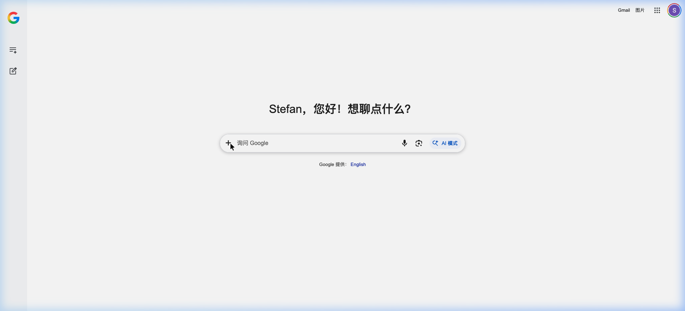
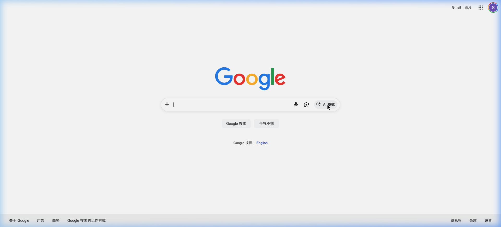

# StefanClaw

> AI-native desktop agent platform powered by OpenClaw — a multi-channel, multi-agent AI gateway for macOS.

[](../../releases)
[](../../releases)
[](LICENSE)

## Screenshots

| AI Chat Interface | Search & AI Mode |
|:-:|:-:|
|  |  |

## Overview

StefanClaw is a macOS desktop application built on **OpenClaw** (v2026.3.8), an open-source multi-channel AI gateway. It connects large language models to real-world tools, messaging platforms, and automation workflows through an extensible Agent + Skill architecture.

The core engine enables AI agents to autonomously plan, execute multi-step tasks, use tools, and maintain persistent memory — all running locally on your machine.

## Key Features

### 🤖 Multi-Agent Architecture
- **54 built-in Skills** covering productivity, coding, media, IoT, and communication
- **42 platform Extensions** for seamless integration across messaging and collaboration tools
- **Self-Improving Agent** — agents can discover and install new skills at runtime
- **Coding Agent** — autonomous code generation, review, and execution
- **Long-chain reasoning** with multi-step task decomposition

### 🧠 Persistent Memory
- `memory-core` — in-process vector memory for cross-session context
- `memory-lancedb` — LanceDB-backed persistent semantic memory store

### 🔗 Messaging Platform Integrations (42 extensions)
**International:** iMessage, Telegram, WhatsApp, Signal, Discord, Slack, MS Teams, Google Chat, Matrix, IRC, Line, Nostr, Twitch, Zalo, BlueBubbles, Mattermost, Nextcloud Talk, Tlon/Urbit

**China Ecosystem:** DingTalk (钉钉), QQ Bot, WeCom (企业微信)

### 🛠 Built-in Skills (54)
`coding-agent` · `github` · `gh-issues` · `notion` · `obsidian` · `apple-notes` · `apple-reminders` · `things-mac` · `spotify-player` · `openai-image-gen` · `openai-whisper` · `gemini` · `voice-call` · `canvas` · `tmux` · `weather` · `trello` · `slack` · `discord` · `1password` · `skill-creator` · `summarize` · `video-frames` · `gifgrep` · `camsnap` · `peekaboo` · `oracle` · and more

### 📦 Pre-installed Skills
- `brave-web-search` — Brave Search API integration
- `tavily-search` — Tavily AI Search
- `bocha-skill` — Bocha web search (China)
- `pdf` / `docx` / `pptx` / `xlsx` — Office document processing
- `find-skills` — Dynamic skill discovery
- `self-improving-agent` — Agent self-upgrade loop

### 🔒 Local-first & Privacy
- All AI inference runs locally via Ollama integration (tested with `qwen3-coder:30b`)
- No cloud dependency required
- Python runtime bundled via `uv` — no system Python needed
- Full browser automation via isolated managed browser

## Architecture

```
StefanClaw.app (Electron shell, macOS)
└── OpenClaw Engine (Node.js / ESM, v2026.3.8)
    ├── Gateway Server (localhost:18789)
    ├── Skills Layer (54 skills)
    ├── Extensions Layer (42 extensions)
    │   ├── Memory (memory-core, memory-lancedb)
    │   ├── Messaging (iMessage, Telegram, WhatsApp ...)
    │   └── Auth (Google Antigravity, Gemini, Qwen ...)
    └── Plugin System
        ├── dingtalk (钉钉)
        ├── qqbot (QQ)
        └── wecom (企业微信)
```

## Tech Stack

| Component | Technology |
|-----------|-----------|
| Desktop Shell | Electron + Squirrel (auto-update) |
| AI Engine | OpenClaw v2026.3.8 (Node.js ESM) |
| Python Runtime | uv (bundled) |
| Memory Store | LanceDB (vector embeddings) |
| LLM Backend | Ollama (local) / Cloud APIs |
| Supported Models | qwen3-coder, Gemini, GPT-4, Claude, etc. |

## Documentation

See the [`docs/`](docs/) directory for detailed technical documentation including:
- Agent architecture & protocols
- Channel & platform integrations
- Plugin development guide
- Security threat model
- Configuration reference

## Download

See [Releases](../../releases) for the latest macOS build (`.zip`).

**Requirements:** macOS 12.0+, Apple Silicon or Intel

## License

MIT © 2026 StefanClaw
